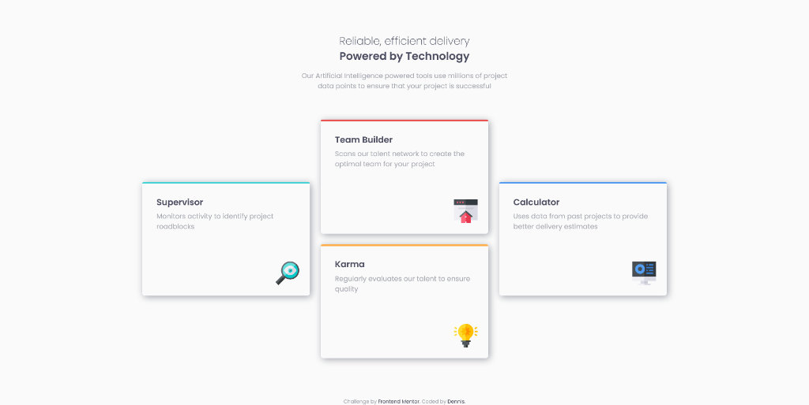

# FM_four-card-feature-section

# Frontend Mentor - Four card feature section

This is a solution to the [Four card feature section challenge on Frontend Mentor](https://www.frontendmentor.io/challenges/four-card-feature-section-weK1eFYK). Frontend Mentor challenges help you improve your coding skills by building realistic projects.

### The challenge

Your challenge is to build out this feature section and get it looking as close to the design as possible.

You can use any tools you like to help you complete the challenge. So if you've got something you'd like to practice, feel free to give it a go.

Your users should:

-   View the optimal layout for the site depending on their device's screen size

### Screenshot

### Links

-   Solution URL: [https://dponline-nl.github.io/FM_four-card-feature/](https://dponline-nl.github.io/FM_four-card-feature/)
-   Live site: [GitHub Pages](https://dponline-nl.github.io/FM_four-card-feature-section/)

### Author

-   Website - [DPonline](https://www.dponline.nl)
-   Frontend Mentor - [@dponline-nl](https://www.frontendmentor.io/profile/dponline-nl)
